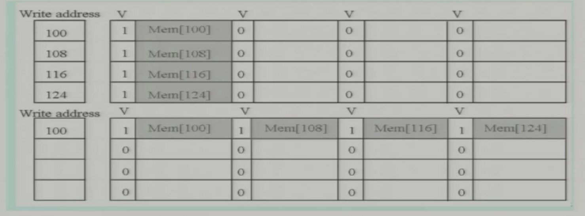
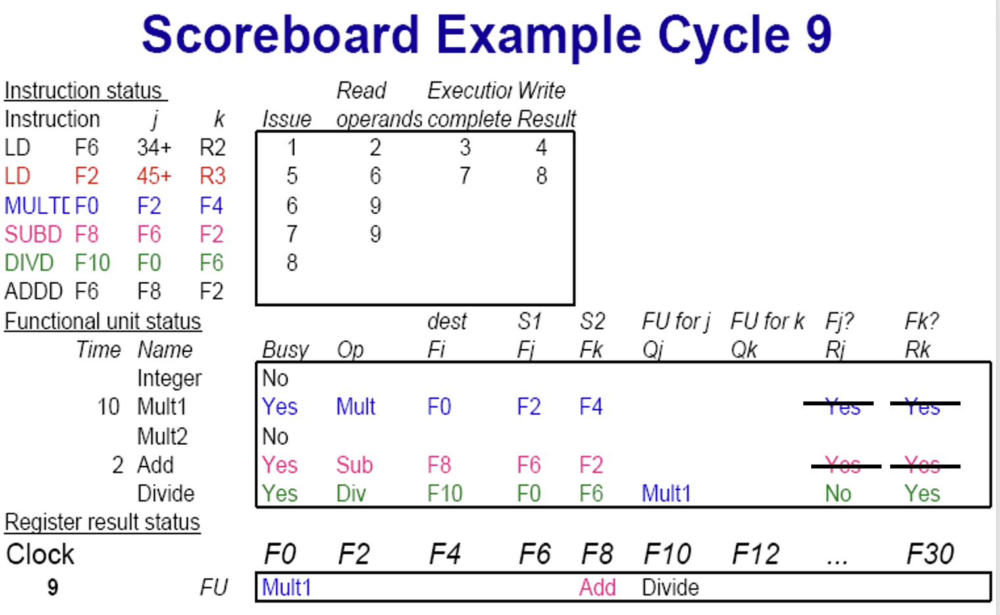
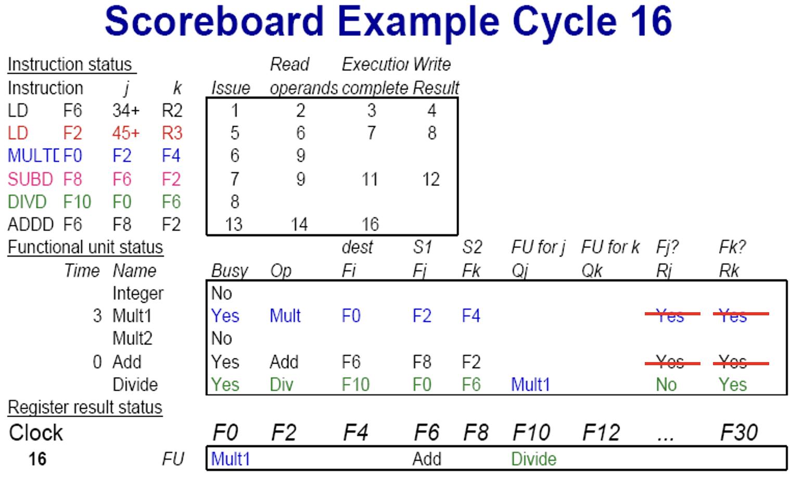
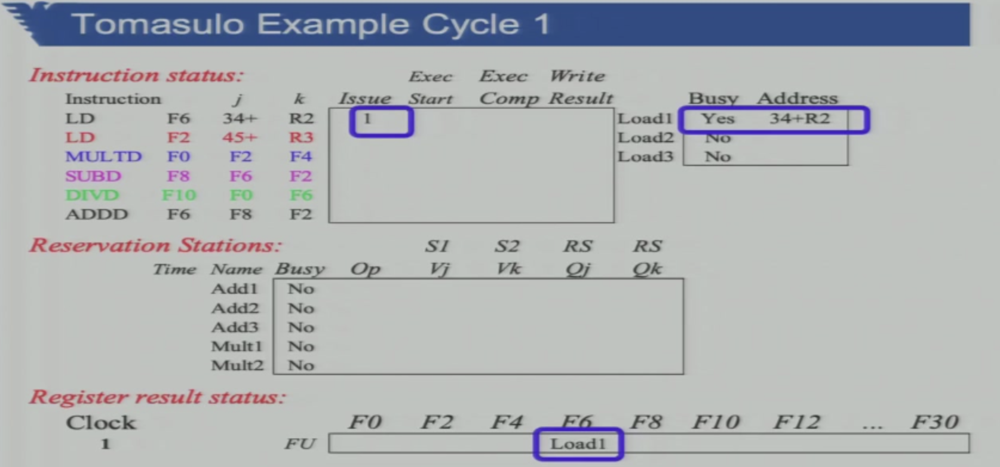

# 提高访存性能

**AMAT平均访存时间**
$$
AMAT=hit\_time+miss\_rate*miss\_penalty
$$

**一图流**

## 优化Hit Time

### Small Simple Cache

减小Cache的复杂度以减小组合逻辑的延迟。

### Avoiding Addr. Translation

如果Cache对应物理地址，每次访问必须先查页表得到物理地址才能查Cache。但是如果Cache对应虚拟地址，这样查Cache之前就不需要先翻译地址了。

### Trace Cache

核心逻辑是缓存逻辑上的指令流，而不是缓存物理顺序的指令流，从而加快指令的预取。比如分支指令，预测不会命中的分支就不cache，这样既节约了cache空间又让相邻的指令cache也相邻，有助于提高性能

## 优化Miss Penalty

### 多级Cache

注意AMAT公式在多级Cache下需要展开。

### 优化Mem访问

- **Critical Words First**
  - 读Mem时不是按地址顺序读一个block大小的数据，而是定位到当前需要的Bytes先读入，同一个block但是没用到的数据稍后再读。
- **Early Restart**
  - 从Mem取到数据后直接给CPU，而不是先放到Cache后CPU再从Cache取

### Merging Write Buffer

写Mem可以有Buffer用于减小CPU等待时间，而这个Buffer本身又可以优化。

标准的写Buffer格式类似上方表格，每个地址各占一个block，但是这就需要四次写入。如果Buffer检测到其中的写地址连续，可以将其合并到一个block中，只需要一次写入。

### Priority to Read Misses

这里是使用了Write Buffer的情况。如果write的数据很快就要被read，可以先不要将buffer的内容写进Mem（写Mem很慢，需要等待，之后又要），而是等到read时直接从buffer读出所需数据，再从buffer写Mem。

### Victim Cache

还有Victim Cache，被替换出去的Cache也不直接丢掉，而是再来一个buffer暂存，万一又用到了呢。

## 优化Miss Rate

### 失配的种类

#### Compulsory

也叫冷启动失配，刚上电Cache是空的。

#### Capacity

Cache块的大小不能满足程序局部性时发生的失配，称容量失配。比如对64KB数组的连续访问，当Cache块大小是64KB时只会发生一次冷启动失配，而大小时32KB时就会发生一次冷启动失配和一次容量失配。

关联度指有多少个内存地址关联到一个Cache块上。内存大小一定时，Cache块数越少，与某个块相关联的内存位置越多，关联度越低。而容量失配与关联度无关，Cache块大小增大，容量失配率减少。 

#### Conflict

在采用组关联和直接映象方式的cache中，主存的很多块都映射到cache的同一块。因这一原因，当程序再次访问到曾装入cache又已被替换出去的某块时，出现冲突失配。 

关联度越高，冲突失配越小。

### Pseudo-Associative Cache

Cache块中有额外的标志，表示与之关联的其他块。CPU访问时如果这个块里没找到，还可以去它关联的块里找。

### Way Prediction

对组相关的cache，预测本组中多个block里哪一个最有可能存有所需数据，优先访问，可以减少conflict miss。

（这里有疑问，hit time也会减少但是总结表里没写）

### Compiler Optimization

由程序员/编译器适当调整代码逻辑使之**Cache友好**：

#### 交换循环顺序

- 下图红色的循环顺序比蓝色的循环顺序Cache命中率高
- 

#### 适当拆分运算配合cache大小

- 
- 

#### 循环融合

- 

## 并行优化

### Non-Blocking Cache

Cache Miss，等待Mem时继续做别的没有冲突的事情，不必要让所有资源都等待Mem。

### Prefatch

可以由硬件控制，类似分支预测的，预测并提前取出可能需要使用的数据放到Cache中。也可以由程序员/编译器手动指定哪些内容应该被放到Cache。

**但是可以通过Prefatch提高性能的前提是这些操作与正常进行的指令是并行的（Non-Blocking）**，如果prefatch需要流水线stall，那反正都是要等，提前取就没有意义了。

**失配次数需要计算：**

- 下图a失配150次，b失配101次。**（为什么？）**

- 但是手动加上一些prefetch，miss数量明显减少

  

  

- 可以定量的计算出prefatch的性能提升程度

  

## Memory结构改进

- **BUS宽度**
  - 与Mem交换数据的单位长度
- **Mem宽度**
  - Mem输出数据的最大长度
- **Memory Interleaving**
  - 多个Memory并行，数据分开存放，相互错位
  - 比如2-ways Interleaving，所有地址模2为0的数据存在其中一个中，模2为1的在另一个中
  - 访问时只需要输入对齐的地址（比如两路并行，只需要输入最低bit为0的地址，最低bit是0和1的地址的数据都会读出来）

比如做如下假设：

- 地址长度 64bit
- Bus延迟 4clk
- Mem延迟 56clk
- Cache块大小 64bit，两路组关联

那么失配时的Mem等待时间为：

- 64bit Bus + 64bit non-interleaving Mem：
  - 用Bus传递地址 4clk
  - Mem延迟 56clk
  - 用Bus传回数据 4clk
  - 上面 (4+56+4) 个周期读回了64bit即1block数据，而因为两路组关联，共需要读2个block，总用时 2*(4+56+4) = 128 个周期
- 64bit Bus + 64bit **interleaving** Mem：
  - 用Bus传递地址 4clk，出于Interleaving，获得两个相邻数据只用发送一次地址
  - Mem延迟 56clk
  - 用Bus传回数据 8clk，出于Interleaving，一次获得了两个相邻地址的数据共128bit，但是Bus只有64bit，因此需要两倍延迟分两次传回数据
  - 总用时 (4+56+8) = 68 个周期
- **128bit** Bus + **128bit** non-interleaving Mem：
  - 用Bus传递地址 4clk，因为Bus是两倍地址宽度，可以一次传完
  - Mem延迟 56clk，因为Mem宽度是128bit，可以认为两个地址各64bit数据可以一次读出
  - 用Bus传回数据 4clk，因为Bus是两倍数据宽度，可以一次传完
  - 总用时 (4+56+4) = 64 个周期

# 降低CPI

## Hazard

在流水线中，限制CPI的一个重要因素是竞争Hazard：

- **Structural Hazard**
  - 由于硬件资源不足而产生的hazard，比如Mem的读和写不能同时进行
- **Branch Hazard**
  - 当碰到跳转指令时，processor可能需要stall直到跳转条件判断得到结果
- **Data Hazard**
  - 前后指令之间有数据依赖造成流水线stall
  - 又具体的分三种，固定流水线中只会出现RAW，但是后面介绍的动态流水线中可以有后面两种
    - RAW（True-Dependence）
    - WAR（Anti-Dependence）
    - WAW（Name-Dependence）

## 软件方法

### 指令重排

先看一个简单的例子，假设复杂运算指令ADDD在EX级需要三个时钟才能运行结束。

左侧是原始汇编，其一次循环需要10个时钟周期；右侧是其经过适当的指令重排后，循环用时降低到了6个时钟。注意这里的重排是由汇编器软件实现的。

### 循环展开

假设循环次数固定为4，汇编时如果对指令重排一节中的两段代码做循环展开，单次循环耗时近一步降低到6.5/3.5。

### 软件流水化

https://blog.csdn.net/diyinqian/article/details/86360396

核心思想是把循环执行的方向从竖向变为横向，以此减少指令之间的依赖。

比如下面这个例子：

我们很容易得到他的依赖关系图：

按照指令顺序竖向执行时，1-2-4-5这条路径上明显会有很多的前后依赖带来很多的停顿。但是如果我们换一个思路：

本质是前后错位，极大的降低了指令之间的依赖，减少了停顿，增加指令并行性。对后面的多发射尤其有利。

## 动态流水线

软件优化是有局限的，比如上图这个例子，其中DIVD、ADDD、MULD都是EX级耗时很长的复杂运算指令，那么出于结构竞争，流水线的执行效率将会很低；再比如，如果处理器中有加法器、乘法器、除法器等多个相互独立的运算单元，静态流水线同时只能利用其中一个，带来资源的浪费。

软件无法解决这样的问题，所以有人提出了动态流水线。

### 计分牌法介绍

一种常用的控制动态流水线的方式是计分牌法。

我们需要三张计分牌（其实就是列表）：

- **指令状态表**：记录流水线内各指令进行的状态，已经完成了哪些步骤
- **功能单元状态表**：记录处理器内每一个硬件单元（Function Unit, FU）的当前的状态，是否被占用、正在进行什么运算等
- **寄存器状态表**：记录寄存器的状态，为了避免读写冲突，需要记录某个Reg是否即将被某功能单元的结果读写

为了解决动态流水线下更加复杂的读写冲突问题，我们对流水线划分进行一些改造：

- **IF**：Instruction Fetch
- **IS**：Issue（发射）
  - 将取到的指令发射到流水线之中
  - 查表，只有所需的功能单元和目标寄存器都空余时指令才会被发射，避免结构冲突（检查功能单元）和WAW（检查dst寄存器）
- **RO**：Read Oprand
  - 查表，只有所有操作数此时均可用时才会取用，避免RAW
- **EX**：Execute
- **WB**：Write Back
  - 查表，涵盖了写Reg和写Mem，避免WAR

### 计分牌法具体过程

下面来看具体的例子：

左上角是指令，按顺序发射；第一个表对应新的流水线；第二个表对应处理器中有五个功能不同的FU，其中Qj、Qk用于指示Forwarding，如果操作数j、k来自某个FU的运算结果，Q处应该标注，Rj、Rk表示Qj、Qk是否已经准备好；第三个表对应Reg。

第一个周期，肯定没有冲突，填表。

第二个周期，第二条指令也需要整数单元，所以不能发射；第一条指令两个Oprand都没有冲突（Rj、Rk都为yes），可以进入RO级。

第三个周期，第二条指令仍然没有得到整数单元，不能发射；第一条指令用整数单元进行运算，进入EX级。

第四个周期，第一条指令完成，上图中是清理第一条指令相关内容之后的表，注意此时第二条指令还没有发射。

红色第五个周期，第二条指令发射；蓝色第六个周期，第三条指令发射，但是注意到乘法器的Rj为No，等待F2；粉红色第七个周期，第四条指令发射，同样在等待F2；绿色第八个周期，第五条指令发射。

上面8a为清理第二条指令相关内容之前，8b为清理之后。F2寄存器WB结束才改Rj、Rk为yes，可见这里没有forward，但加入forward也只是更改的时机不同，不影响计分牌法。

第九个周期，ADDD指令需要Add单元，不能发射；F2写回完毕，两条正在RO级等待的指令可以进入EX级。

此后同理即可。

第十六个周期ADDD计算完毕，但是注意第十七个周期ADDD不能写入，因为**存在WAR竞争**。查表的方法是：

- 现在ADDD尝试写F6
- 查找第二个计分牌中其他FU的Fj、Fk是否含有F6，如果不含则可以写入
- 如果其他FU的Fi、Fj中含有F6，则查Qj、Qk
  - 如果Qj、Qk为No，代表这条指令逻辑上在当前写入之后，可以写入
  - 如果Qj、Qk被划掉了，代表源数据已经被读走了，可以写入新的值，不影响正在进行的运算
  - **如果Qj、Qk为Yes且没有划掉，代表这条指令逻辑上在当前写入之前，且还没有取操作数，此时不能写入**

## Tomasulo

### 原理

只有RAW才是真正的相关，后面两种从逻辑上并没有构成相关，但是上面的动态流水线仍然需要等待这些情况。Tomasulo进一步对计分牌法做出优化，核心思路是从动态流水线的整个系统集中控制改为各个部件分散控制，以实现更灵活的资源应用。

- 在计分牌法中整个系统由计分牌集中控制
  - 两个操作数都就位才读数
  - 所以要写入时集中判断有没有后面的指令需要覆盖写入，而要用到原值的指令还没有RO
- **但是在Tomasulo中，运算单元有自己的Reg（保留站），分散控制**：
  - 可不可以读操作数由运算器自行判断，且读来一个可以放着等待，不需要等两个都好了才一次读完
    - 使用**CDB公用数据总线**进行数据交换，具体地说是所有运算结果都会在CDB上广播，各功能单元持续监听并自行决定是否取用
  - 有一点特别的是，Load这里也被看成单独的运算器，用于计算base+offset
  - 两个数都读到后，运算器自动开始运算
  - **因为不需要等两个操作数都ready，而是其中任何一个ready后就会主动被运算器取走，Tomasulo一定不存在WAR冲突**

因此Tomasulo的流水线可以进一步简化：

- Issue不变，需要判断功能单元有没有空位，写入的位置是否已经被使用
- 不需要RO级了，任何时候源操作数可用都会被运算器主动取走
- EX级不变
- WB级可以直接写，不需要判断关联性

### 具体过程

第一个时钟，第一条指令可以发射。

第二个时钟，因为Load有三个，写入的reg也没有冲突，第二条指令可以发射；第一条指令取到了数，开始运算。

第三个时钟，第三条指令所需的写入Reg和FU都没有冲突，可以发射，**注意此时F4没有竞争，已经由乘法器主动获取并暂存，而F2需要等待**；第二条指令正常运算；第一条指令运算结束。

第四个时钟，第一条指令直接写回不需要判断竞争，执行结束，上图中已经完成了计分牌内容的清理；第四条指令可以发射，**ADD运算器主动读取走同一时钟写回的F6，暂存等待F2**；第二第三条指令继续等待。

第五个时钟，第二条指令直接写回，执行结束，上图中已经完成了清理；第三、四条指令的运算器自动读走了同一时钟里写回的F2，两个运算数都取到了，下一时钟将开始进行计算；第五条指令运算器与写回Reg都没有冲突，可以发射。

第十三个时钟，注意到ADDD指令与DIVD指令构成WAR冲突，但是根据Tomasulo，DIVD需要的操作数肯定已经被Mult2运算器取走暂存，所以**可以直接写入而不像标准计分牌中一样需要等待**。

## Speculation

Speculation硬件投机算法基于Tomasulo。核心思想是**乱序发射执行**，某一条指令所需的写回Reg或者FU有占用不能发射时，可以往下看看有没有别的指令此时没有冲突可以发射；**但是程序的完成，即结果的写回必须是有序的，由ROB乱序执行缓冲区负责控制。**（ROB的功能之一是寄存器重命名）

硬件投机算法中，流水线在WR之后多一级commit：

- WR只是将运算的结果写到ROB
  - 指令WR之后保留站中的相关内容就会被清空
  - 这时其他指令可以引用这个临时结果了（tomasulo不存在WAR冲突）
  - 但是还没有修改寄存器或内存里的值
- commit将结果从ROB提交到reg/mem
  - ROB控制commit顺序和时机
  - **commit决定了精确中断的返回位置**
    - 在计分牌/tomasulo中，指令可能是乱序写回的，这导致中断难以处理
    - 但是ROB保证指令顺序写回解决了这个问题
  - 对分支预测错误的指令，要清空计分牌与ROB中该指令之后的所有指令，再重新按照正确的执行路径启动代码

## 分支预测

### 1-bit分支预测

用1bit记录前一次是否跳转，按照前一次相同的结果预测跳转。

### 2-bit分支预测

用2bit记录前几次跳转的状态。跳转则+1，到2‘b11为止；不跳则-1，到2’b00为止。高位为1则预测跳转；为0则预测不跳。更多bit也是同理。

### 关联预测

（m, n）关联预测表示：

- m位的全局预测器，记录前m条跳转指令的跳转情况，共2^m种可能
- n位的局部预测器，共有2^m个，与全局预测的2^m种情况一一对应，代表这种情况下的分支预测结果

比如（2, 2）关联预测：

- 下图红框表示全局预测器的历史记录
  - 比如准备执行第三条跳转指令时，全局预测器会记录第1、2条跳转指令的结果00，表示前两条跳转指令都是Not Taken
- 这里局部预测器共有4个，分别对应00、01、10、11四种全局预测器的历史记录情况
  - 当前历史记录为00，所以选用对应00情况的局部预测结果，这里是0，即预测NT
- 第三条跳转的确是0/NT（图中最上方给出），所以00号局部预测器的值-1，保持00
- T or F表示预测是否成功，显然第一次是成功的

- 类似的，在下图情况下，全局记录为11
- 将会选用11号局部预测器的结果，这里为0，即预测NT
- 但是可以看到本次跳转应该为1/Taken，出现了预测失误
- 之后11号局部预测器的值将+1，变为01

关联预测还可以更进一步，设置k个项，每个项对应程序中的一条分支指令，对不同的分支指令独立统计跳转结果。比如下图是一个有16个项的（10, 2）关联预测器。

## 多发射

### Superscalar

Superscalar是硬件指令层面上的多发射并行，由硬件完成控制。

下面是一个Tomasulo 下双发射的例子，假设整数运算、LD/ST、浮点运算分别需要三个时钟完成；运算单元只有一个。注意有分支时没有多发射，因为预测错误时清理流水线的控制较复杂。

### VLIW

Very Long Instruction Word超长指令字，指在编译时预先按特定的格式将多条没有相互依赖的指令打包在一起，成为一条超长的大指令。哪怕在CPU内部这些超长指令单发射执行，也可以间接实现多发射指令并行的效果。

优点是可以通过填充保证每次发射的指令定长且格式统一，有利于处理器内部设计；在理想状态下指令密度非常高。但是编译器实现过于复杂且实际情况下很难充分利用超长指令，造成很大的浪费。现在基本没人用。

# 多处理器

先将处理器系统简单的分类：

- SISD：单指令单数据，常规处理器
- MISD：多指令单数据，没人用
- SIMD：单指令多数据，**多个处理器**，各自有数据，但总是执行相同的指令
- MIMD：多指令多数据，**多个处理器**各自执行，也是本章需要探讨的内容
  - 注意区分MIMD和多发射不是一回事，单个处理器内部可能有多个不同运算单元，一个周期发射多条指令，但这不叫MIMD

如果有多个处理器，按照处理器之间信息交流的方式可分：

- UMA（SMP）：集中共享（对称式），指处理器有自己的运行上下文（reg、cache等），但是集中共享Mem和IO；处理器之间一般使用Bus相连接。
- NUMA（DSM）：分散共享（非对称式），每个机器都是独立的系统，通过外置的互联网络协调为一个整体

在具体讨论多处理器系统之前，还需要回顾一下阿姆达尔定律：

- 

## Cache Coherence

众所周知处理器系统内有很多很多cache相互嵌套，除非每一次写入都一次写到底（但这是不可能的，这样cache没有意义了），不然就一定会造成数据不一致的问题。

单处理器且IO完全由处理器控制时，通过stall（wait）等待数据同步；但是在使用DMA，或者有多个处理器时，必须要另外的规则来避免一致性问题。

### Snooping

**侦听协议**。设备侦听总线上的变化，并实时的判断当前的操作是否会带来数据不一致，自己是否需要做出调整。因为Snoop基于总线，它只能适用于SMP系统。

具体实现又大致可分两种，区别有一点像write through/write back，一个是直接写，另一个是先标记无效，真要用的时候再说：

- **Write Invalidate**：写数据的人在BUS上广播自己要写X了，其他Cache中有X的设备做个标记，当前X已经无效了（要用到的时候再去取）
  - 读miss的做法不是直接去Mem取，因为Mem不一定是最新的
  - 而是发生读miss的设备把这件事放在总线上，谁拿着最新的数据，谁侦听到这条消息之后就在总线上把数据回应回去
- **Write Broadcast**：写数据的人在BUS上广播自己写X为X‘，所有Cache有X的设备同时跟着一起写X‘

下面来看Write Invalid+Write Allocate具体的例子：

设备状态中：

- **Share**表示这个数据从外部读来，自己没有改动（所有share状态的同一个数据，值肯定是相同的）
- **Exclusive**表示这个数据已经被自己写入但是还没有写入内存，当其他人这个读数据miss的时候自己应该做出回应

下面分步看CPU内部执行过程：

- 第一步，P1写A1为10：
  - P1的Cache中A1写为10，状态为exclusive
  - P1向总线发出Write **Miss**信息，表示自己写了A1，此时其他所有持有A1的设备应该将其无效
- 第二步：P1读A1
  - exclusive还是exclusive
- 第三步：P2读A1
  - P2在总线上放出了A1 Read Miss消息
  - P1侦听到了Read Miss且此时自己手里拿着Exclusive的A1，所以P1在总线上Write Back A1，并将A1 cache的状态改为Share（已经把A1回应出去，这个值肯定是和其他人Share而不是自己独有的了）
  - **P1 Write Back，Mem才更新，同时P2侦听到总线的消息，也读到了A1，状态设为Share**
- 第四步：P2写A1为20
  - P2的Cache中A1写为20，状态为exclusive
  - **只有写Exclusive的数据才是Write Hit，这里P2在总线上发的消息是Write Miss**（读share/exclusive都算Hit）
  - **P1收到了P2 Write Miss A1，将自己的A1 cache无效化**

### Directory-base

侦听协议只适用于总线连接的多处理器系统，对分布式的系统就需要**基于目录的Cache一致性协议**。

在分布式的多处理器系统中，将节点分为以下三类，但是注意三者并不是互斥的，可以两两组合、三者合一。

- **Home**：某个数据名义上的所有者
- **Local**：发起某个数据访问的节点
- **Remote**：持有最新数据的节点

协议的具体内容如下：

- 跟Snooping有一点像，只不过并不是所有的操作都在同一条BUS上共享，而是各找各家，某个数据的消息由其对应的Home节点中转
- Local发生读/写Miss或者要求某个数据无效化，只要把对应的消息发给Home
- Home将读写miss信息转发给对应的Remote节点
  - 这要求Home需要额外维护数据与Remote节点的对应表
  - 下面使用Write Invalidate，写Miss对应Fetch and Invalidate
  - 也可以使用Write Broadcast，写Miss时Home发送Write消息要求所有Remote更新值即可
- Remote需要回应Home的Fetch消息，Home再将Remote的回应再回给Local

下面来看具体的例子：

- M表示Memory，其中状态S/E代表Share/Exclusive，与此前相同；U代表uncatch，意味着这个数据此时没有被任何处理器cache
- **注意到Mem只有本机的，而处理器Cache的数据可以来自任意机器**
- 首先要看懂下面红框的部分怎么来，考试可以出填空题
- 当P0读地址300
  - P0查自己的Cache，发现Miss，发消息给P2说自己读Miss（通过地址首位知道其Home节点）
  - P2查自己的Mem，发现地址300的数据不是Exclusive，直接传回P0，并更新Mem信息「{P0}, S, 300, 0300」
- 当P2读地址218（和上一问没有关联，仍然从下图开始）
  - P2查自己的Cache，发现Miss，发消息给P1说自己写Miss
  - P1查自己的Mem，发现218地址的状态是Exclusive，最新的数据在P0，所以发消息给P0要求Fetch
  - P0通过总线Write Back 218地址的数据，并将**Cache改为「S, 218, 1218」**
  - P1接收到P0的写回，**将Mem改为「{P0, P2}, S, 218, 1218」**并通过总线继续回应给P2
  - P2把218放进自己尾号18的cache里，**改为「S, 218, 1218」**
- 当P1写地址310为0888（仍然从下图开始）
  - P1写查自己cache，发现Miss，发消息给P2
  - P2查自己Mem，发现310位置有两个Share，分别发消息让他们Invalid
  - P0、P2改好Invalid之后ACK回复P2
  - P2回复P1操作完成，**P1在自己的Cache里把110换出（因为是Share不用WB），放进310并将值写为0888；P2的Mem只用标记此时310为P1 Exclusive即可，不用管新的值**

## Mem Coherence

多处理器下一定需要锁来保证内存的互斥访问。

### 没有原语

第一种方案，不能实现锁，代码段不是互斥的，两个处理器可以同时进入。**（为什么？）**

第二种方案，是互斥的，但是会带来死锁。**（为什么？）**

第三种方案，通过让步对方先行避免了死锁，是最早的锁。**（为什么？）**

### 原语

原语指由处理器硬件保证不会被中断的指令，常见的的有：

- **EXCH**：双方的值交换（注意交换带来两次IO，读写分别都可能miss）
- **T&S**：硬件为每一个资源维护一个锁，只有目标资源无锁时（通过Test）才会设为你希望的值（Set新值）
- **LL&SC**：Load Linked在Load一个资源的同时设置一个Link标志，Store Condition检测Link标记是否有被更改（即刚刚做的事情有没有被别人打断过），如果打断过则返回0表示刚才的操作不能完成
- 

### Spin Lock

自旋锁，即最简单的忙等待锁`while(busy) waiting;`。前面的三个原语显然都可以非常方便的实现自旋锁。

### Barrier

同步机制，处理器到Barrier后停下等别人，大家都到了才能一起往下。
